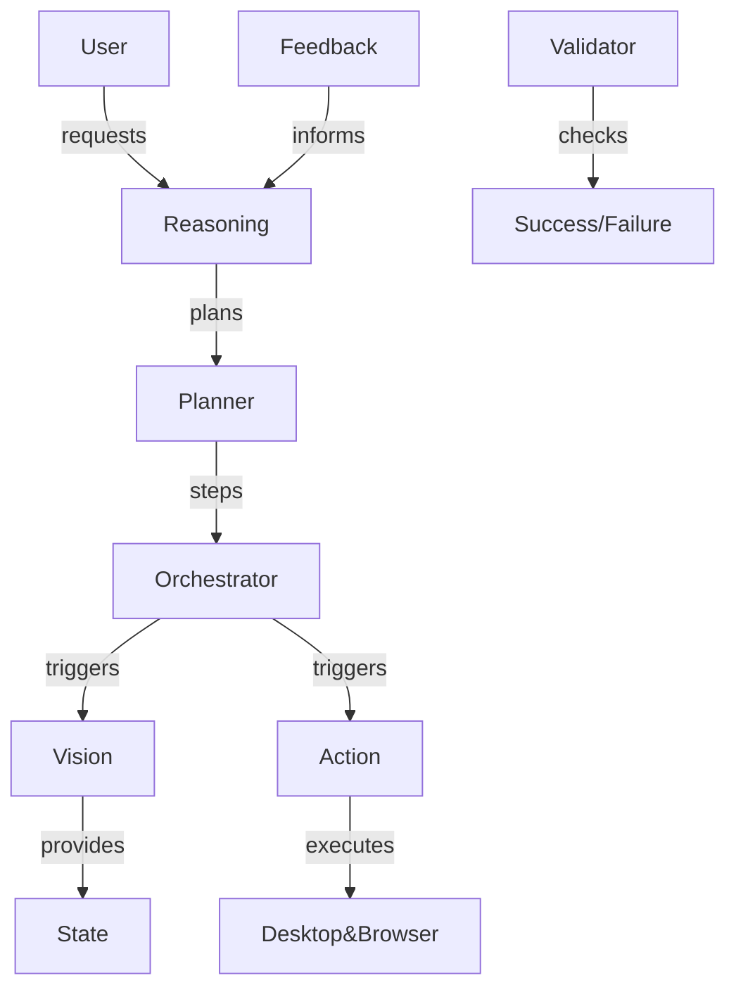

# 🚀 Aletheia AI: The Autonomous Thinking Assistant

 <!-- 👉 Add a banner or logo here -->

[](https://github.com/jayaprakash2207/Aletheia-AI---Autonomous-Thinking-Assistant/actions/workflows/ci.yml)


---
### 🤔 What is Aletheia AI?

**Aletheia AI** is a next-generation, production-focused AI agent capable of *thinking*, *planning*, *seeing*, *acting*, *validating*, and *improving itself*—mirroring the workflow of a human assistant, but supercharged by generative AI.  
It’s your plug-and-play engine for desktop, browser, and hybrid task automation.

---

## 🎆 Why Aletheia? (Key Innovations)

- **Autonomous Reasoning Loop**: Not just a script, but a system that *thinks before acting* (driven by LLMs like Gemini).
- **Long-Horizon Planning**: Breaks ambitious requests into actionable, adaptive plans.
- **Real-World Awareness**: "Sees" your desktop using screenshot vision—operates on what’s *really* there.
- **Flexible Actions**: Controls browser, apps, mouse, and keyboard seamlessly.
- **Feedback-Driven Learning**: Detects errors, understands outcomes, adapts & retries—like a human!
- **Self-Correcting Execution**: Quickly recovers from failures, devises new strategies, and logs diagnostics.
- **Modern GUI Option**: User-friendly desktop interface—no command-line needed.
- **Extensible Architecture**: Modular code structure ready for new actions, integrations, and AI backends.

---

## 🎬 Live Demo

<!-- Recommend adding a striking GIF, screen recording, or screenshot here -->

*See Aletheia AI autonomously open a browser, search the web, and adapt to success/failure in real time!*

---

## 🏗️ Architecture At a Glance


> **Modular Components:**
>
> - **Reasoning Engine:** Understands intent & devises strategies.
> - **Planner:** Translates strategies into steps.
> - **Vision Module:** Captures/analyzes desktop screens.
> - **Action Engine:** Executes clicks, keys, browser commands.
> - **Validator:** Checks if the outcome matches intent.
> - **Feedback/Correction:** Learns & retries when things go sideways.
> - **Orchestrator:** Keeps all parts in sync for full autonomy.

---

## 🗂️ Project Structure (Code Map)

```
Aletheia AI/
│   .env.example
│   requirements.txt
│   README.md
│   pyproject.toml
└───src/
    └───aletheia_ai/
           main.py             # Central entry point
           bootstrap.py
           config.py
           logging_config.py
           core/               # Foundational classes
           reasoning/          # LLM-driven logic
           planning/           # Task step breakdown
           vision/             # Screenshot/visual context
           action/             # Execution engine
           validation/         # Outcome checking
           feedback/           # Self-improvement
           orchestrator/       # Task manager
           utils/              # Common helpers
           ui/                 # Desktop GUI
```
*Each folder = one production module; explore to extend or swap AI backends!*

---

## 🚀 Getting Started

### 1. **Setup Environment**

```bash
python -m venv .venv
source .venv/bin/activate  # On Windows, use: .venv\Scripts\activate
pip install -r requirements.txt
pip install -e .
cp .env.example .env
```
Add your **Gemini API key** to `.env`.

---

### 2. **Start the Assistant**

#### Terminal Mode
```bash
python -m aletheia_ai.main --task "Open browser and search GitHub Copilot"
```
#### GUI Mode
```bash
python -m aletheia_ai.main --gui
# ...or just python -m aletheia_ai.main for default GUI prompt
```

---

## 🦾 Core Use Cases

- **Zero-shot task automation**
- **Smart multi-step workflows**
- **Search, browse, and interact with the web**
- **GUI desktop control with validation & retry**
- **Adaptation to dynamic UI changes**
- **Prototyping your own GPT-style operator**

---

## 🧠 How It Works (Example Flow)

1. **You**: _"Book me a calendar slot for tomorrow at 2PM."_
2. **Aletheia AI**:
    - **Thinks** (chains of thought using LLM)
    - **Plans** (step sequencing)
    - **Looks** (screenshot analysis: is the calendar open?)
    - **Acts** (mouse/keyboard, browser automation)
    - **Validates** (was the slot booked?)
    - **Self-corrects** (retries or adapts to errors!)

---

## ⚡ Advanced Features

- **Plug in any LLM** (swap Gemini for alternatives—just update the backend!)
- **Add new skills** (extend the agent with Python modules)
- **Centralized Logging & Monitoring** support
- **Policy Guardrails** for safe automation

---

## 🛡️ Safety First!

- *Desktop automation can act on your system—test in a virtual machine/sandbox if unsure.*
- *Never add sensitive keys/secrets to source or public repos!*
- *Limit automation to trusted domains/apps.*

---

## 🏢 Production Checklist

- Integrate with **secret managers** (AWS, Azure, GCP, etc.)
- Connect to **logging backends** (Datadog, ELK, etc.)
- Use **policy guardrails** for safe execution.
- Implement **integration tests** in a controlled environment.

---

## 🤝 Contributing

**We welcome your ideas, bug reports, and pull requests!**
- Fork the repo, branch off, and code away.
- Add docs and tests for your new features.
- Open a PR and let’s build the future of AI agents!

---

## 🌐 Links

- [Project Issues](https://github.com/jayaprakash2207/Aletheia-AI---Autonomous-Thinking-Assistant/issues)
- [Project Wiki](https://github.com/jayaprakash2207/Aletheia-AI---Autonomous-Thinking-Assistant/wiki) <!-- create one for guides, roadmap, etc. -->
- [CI/CD Status](https://github.com/jayaprakash2207/Aletheia-AI---Autonomous-Thinking-Assistant/actions)

---

## 📄 License

[MIT](LICENSE)

---

> **Built for fully autonomous operations in a multi-agent world.  
> Inspired by the search for transparent, adaptive artificial intelligence.**

---

<!--
For the most attractive README:
- Place DEMO GIFs above
- Add a visual banner at the top (images/banner.png)
- Add screenshots or flowcharts using Mermaid or draw.io
- Use shields.io badges for status, build, Python version, etc.
- Consider ASCII or SVG diagrams for architecture
-->
